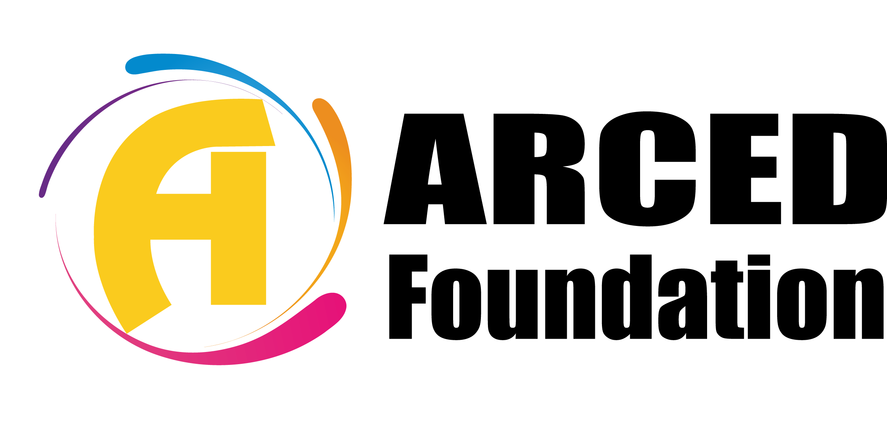

    
    <h1 align="center">Think Change, Think Data</h1>
   
  

  

 

  

      <h2 style="text-align: center; margin-bottom: 1%">GitHub Repositories</h2>
 

        <!-- Coinflip Repository Card -->
        

          

            <h3 style="margin: 0; text-transform: uppercase; color: #009999">
              Coinflip
            </h3>
            

              A SurveyCTO Field plug-in for coin flip simulation and randomly
              record a value.
            

          

          

            

              

                JS, CSS
                Stars: 2
                Forks: 0
              

              <a
                href="https://github.com/ARCED-Foundation/coinflip"
                style="text-decoration: none; color: #2ea44f; font-weight: bold"
                >View Repository</a
              >
            

          

        

 <!-- Catigen Repository Card -->
        

          

            <h3 style="margin: 0; text-transform: uppercase; color: #009999">
              Catigen
            </h3>
            

              A Stata command to automatically generate SurveyCTO advanced CATI
              from a SurveyCTO CAPI.
            

          

          

            

              

                Stata, Tex
                Stars: 2
                Forks: 1
              

              <a
                href="https://github.com/ARCED-Foundation/catigen"
                style="text-decoration: none; color: #2ea44f; font-weight: bold"
                >View Repository</a
              >
            

          

        

 <!-- Odkmerge Repository Card -->
        

          

            <h3 style="margin: 0; text-transform: uppercase; color: #009999">
              Odkmerge
            </h3>
            

              A Stata module to merge selected variables from the parent file to
              the children files generated from ODK or SurveyCTO.
            

          

          

            

              

                Stata, Tex
                Stars: 3
                Forks: 0
              

              <a
                href="https://github.com/ARCED-Foundation/odkmerge"
                style="text-decoration: none; color: #2ea44f; font-weight: bold"
                >View Repository</a
              >
            

          

        

  <!-- Odksplit Repository Card -->
        

          

            <h3 style="margin: 0; text-transform: uppercase; color: #009999">
              Odksplit
            </h3>
            

              Odksplit is a Stata module to label the variables, assign
              corresponding value labels, and split and label multiple response
              variables generated from ODK.
            

          

          

            

              

                Stata, Tex
                Stars: 2
                Forks: 1
              

              <a
                href="https://github.com/ARCED-Foundation/odksplit"
                style="text-decoration: none; color: #2ea44f; font-weight: bold"
                >View Repository</a
              >
            

          

        

 <!-- Integer-placeholder Repository Card -->
        

          

            <h3 style="margin: 0; color: #009999; text-transform: uppercase">
              Integer-placeholder
            </h3>
            

              A simple replacement for the default integer field with dynamic
              input text in the placeholder.
            

          

          

            

              

                JS
                Stars: 0
                Forks: 0
              

              <a
                href="https://github.com/ARCED-Foundation/integer-placeholder"
                style="text-decoration: none; color: #2ea44f; font-weight: bold"
                >View Repository</a
              >
            

          

        

  <!-- Translation-tables Repository Card -->
        

          

            <h3 style="margin: 0; color: #009999; text-transform: uppercase">
              Translation-tables
            </h3>
            

              This repo contains translations for SurveyCTO web form components.
            

          

          

            

              

                Language
                Stars: 0
                Forks: 0
              

              <a
                href="https://github.com/ARCED-Foundation/translation-tables"
                style="text-decoration: none; color: #2ea44f; font-weight: bold"
                >View Repository</a
              >
            

          

        

      

    

  <footer
      style="
          color: rgb(0, 0, 0);
         padding: 20px;
        text-align: center;
      "
    >
      
&copy; 2024 ARCED Foundation. All rights reserved.

       
</footer>

   

      <a
        href="https://arced.foundation/"
        style="
          background-color: #2ea44f;
          color: white;
          padding: 10px 20px;
          text-decoration: none;
          border-radius: 5px;
          margin-right: 10px;
        "
        >Website</a
      >
      <a
        href="https://github.com/ARCED-Foundation"
        style="
          background-color: #2ea44f;
          color: white;
          padding: 10px 20px;
          text-decoration: none;
          border-radius: 5px;
          margin-right: 10px;
        "
        >Github</a
      >
      <a
        href="https://www.linkedin.com/company/aarced/?originalSubdomain=bd"
        style="
          background-color: #2ea44f;
          color: white;
          padding: 10px 20px;
          text-decoration: none;
          border-radius: 5px;
          margin-right: 10px;
        "
        >LinkedIn</a
      >
      <a
        href="https://arced.foundation/publication.php"
        style="
          background-color: #2ea44f;
          color: white;
          padding: 10px 20px;
          text-decoration: none;
          border-radius: 5px;
          margin-right: 10px;
        "
        >Publication</a
      >
      <a
        href="https://arced.foundation/project.php"
        style="
          background-color: #2ea44f;
          color: white;
          padding: 10px 20px;
          text-decoration: none;
          border-radius: 5px;
        "
        >Projects</a
      >
    

